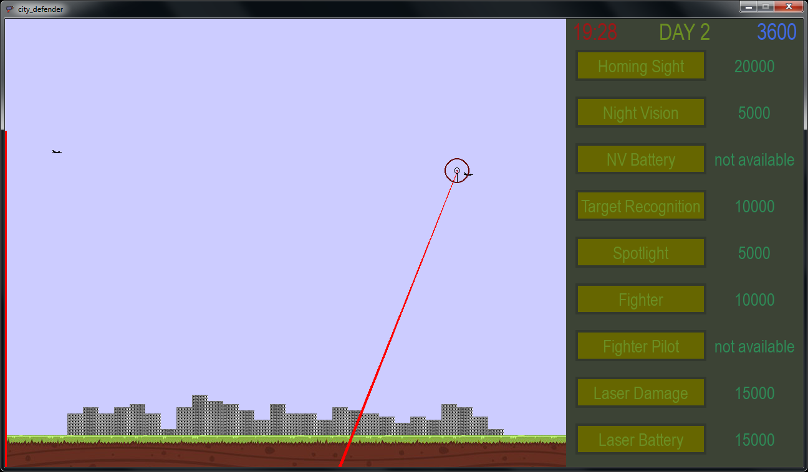

# 2D Game "City Defender"
## About game
The essence of the game is to shoot down enemy aircraft trying to bomb the city with a laser. To win, it is enough to save at least one building by the end of the 10th day. The player can buy upgrades with earned points. Points are awarded for the successful shooting down of aircraft. There are also fines.
You can get a rough idea of the gameplay by looking in the screenshots folder.
To start the game, just run the .exe file.

## Why i decided to make a game
I created this game to practice python programming. Since I haven't explored any libraries or frameworks yet, creating a simple game using pygame seemed like a good idea to me. But in the end the game turned out to be more difficult than I expected at the beginning. However, I like what I got.

## Program structure
- **File _sprites.py_** stores the classes of sprites and other game elements (surfaces).
- **File _sqripts.py_** contains classes Game and Level, containing scripts for the interaction of the player with the sprites, and the sprites among themselves. How the game should take place.
- **File _main.py_** is the main one, and contains the logic for changing levels.
